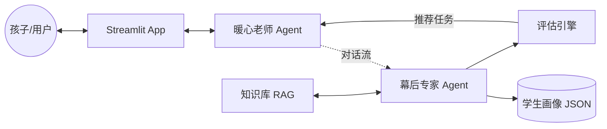

# 架构设计说明书 (Architecture Design)

## 1. 总体架构图 (Agentic Workflow)

系统采用 **双 Agent + 状态机编排** 的模式，将“教学交互”与“画像分析”解耦。

## 2. 核心组件说明

### 2.1 Agent 层
- **暖心老师 (Teacher Agent)**: 负责自然语言交互，遵循“苏格拉底式提问”，维护对话氛围。
- **幕后专家 (Analyst Agent)**: 负责非对称分析。它不直接回复用户，而是输出结构化的画像更新建议。

### 2.2 评估与任务层 (Assessment & Task)
- **任务调度器 (Task Scheduler)**: 位于 `assessment_engine.py`，根据维度的“置信度”和“覆盖率”动态推荐任务。
- **互动任务库 (Interactive Library)**: 提供 HTML5 小游戏和结构化量表，用于硬核指标探测。

### 2.3 记忆与上下文层 (Memory & Context)
- **RAG 引擎**: 基于 `scikit-learn` 的向量检索，按需加载心理学理论。
- **持久化管理器**: 负责本地 JSON 文件（Profile, Chat, Progress）的原子化读写。

## 3. 数据流转规则
1. **输入触发**: 用户输入文字/语音。
2. **初步回复**: Teacher Agent 生成共情回复，并检查是否有 Pending 任务需要嵌入。
3. **后台分析**: Analyst Agent 在后台并发（或顺序）运行，分析该轮对话，更新 `student_profile.json`。
4. **状态变更**: 如果 Analyst 确认了某个特征，Workflow 状态机可能会触发“阶段流转”（如从‘破冰’进入‘深度评测’）。

## 4. 接口规范 (MCP)
未来计划将 Profile 和 Knowledge 封装为 MCP 资源，支持以下操作：
- `get_student_profile()`: 获取当前画像。
- `update_hypotheses(dim, text)`: 添加新的行为假设。
- `search_knowledge(query)`: 在教育知识库中检索。
