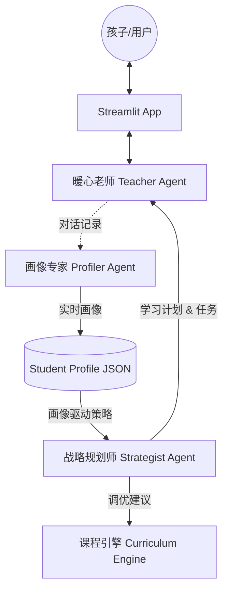

# 架构设计说明书 (Architecture Design)

## 1. 总体架构图 (Agentic Workflow)

系统采用 **多 Agent 协作 (Multi-Agent) + 动态闭环** 的模式。

## 2. 核心组件说明

### 2.1 三 Agent 协同层 (In Progress)
- **暖心老师 (Teacher Agent)**: 
    - **职责**: 前端情感交互、支架式引导、任务分发。
- **画像专家 (Profiler Agent)**: 
    - **职责**: 对话特征提取、BKT 掌握度更新、心理动机分析。
- **战略规划师 (Strategist Agent)**: 
    - **职责**: 依据 KG (知识图谱) 设定长短期目标，生成个性化学习路径。

### 2.2 评估与规划层 (Assessment & Planning)
- **知识图谱 (K12 Knowledge Graph)**: 核心底层依赖，定义知识点依赖关系。
- **规划引擎 (Planning Engine)**: 生成 `learning_plan.json`，记录目标的达成情况。

### 2.3 适应性 Skill 层 (Adaptive Skills)
- **BKT 追踪器**: 量化知识掌握概率。
- **Math Gen**: 基于 BKT 与 计划 的动态题目生成。
- **Report Gen**: 家长端深度报告。

## 3. 国际化先进方法论 (Advanced Methodologies)
1. **BKT (Bayesian Knowledge Tracing)**: 算法驱动的掌握度评估。
2. **Scaffolding (支架式教学)**: Vygotsky ZPD 理论的工程化实现。
3. **Mastery Learning (精通学习)**: 确保核心能力达标后的螺旋式上升。
