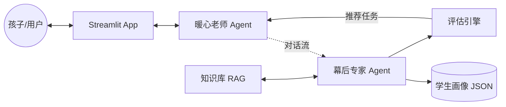

# 架构设计说明书 (Architecture Design)

## 1. 总体架构图 (Agentic Workflow)

系统采用 **双 Agent + 状态机编排** 的模式，将“教学交互”与“画像分析”解耦。

## 2. 核心组件说明

### 2.1 双 Agent 协同层 (Implemented)
- **暖心老师 (Teacher Agent)**: 
    - **职责**: 负责 100% 的前端交互、情感共鸣和对话逻辑。
    - **特点**: 轻量级 Prompt，极速响应，专门负责将评估任务自然“话疗”式地带入对话。
- **幕后专家 (Analyst Agent)**: 
    - **职责**: 静默分析对话历史，映射教育理论，维护 JSON 画像。
    - **特点**: 深度推理 Prompt，后台异步分析（模拟），负责假设验证与去伪存真。

### 2.2 评估与任务层 (Assessment & Task)
- **任务调度器 (Task Scheduler)**: 位于 `assessment_engine.py`，根据维度的“置信度”和“覆盖率”动态推荐任务。
- **互动任务库 (Interactive Library)**: 提供 HTML5 小游戏和结构化量表，用于硬核指标探测。

### 2.4 适应性 Skill 层 (Adaptive Skills)
系统集成了国际先进的教育评测 Skill：
- **BKT 追踪器 (Bayesian Knowledge Tracing)**: 实现对单个知识点（如：进位加法）的掌握概率建模。
- **ZPD 支架逻辑**: 提供分级提示（Hints）机制，评估孩子的受助表现。
- **自动化出题器 (Math Problem Gen)**: 根据 BKT 结论动态生成针对性题目。

## 3. 国际化先进方法论 (Advanced Methodologies)
本项目深度集成了以下国际主流的教育技术理论：
1. **BKT (贝叶斯知识追踪)**: 来源于伯克利和 CMU 的主流 ITS 算法，用于精准量化掌握度。
2. **Scaffolding (支架式教学)**: 基于 Vygotsky 的 ZPD 理论，强调引导而非灌输。
3. **Mastery Learning (精通学习)**: 基于 Bloom 的教育理念，确保知识点过关后才进入下一阶段。
